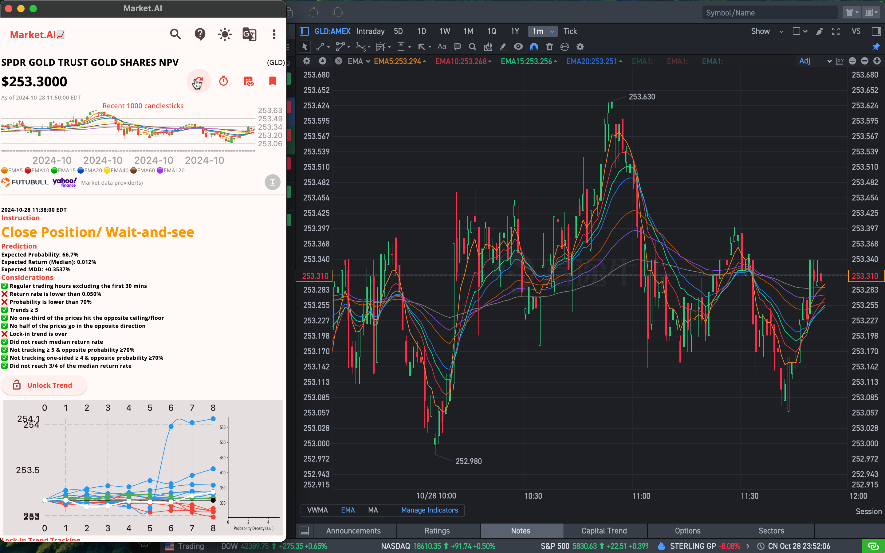

# Market.AI

Experimental screenshots during development:
(The instruction setting is too strict) 
(The probability density plot is under construction)

### Source code is provided for reference only. After the presentation, many modifications were made for my own purposes, including but not limited to the better trade instruction, advanced search, and macOS version.

### Credits

Lau Ka Pui, Mak Wai Hang, Shum Wing Lam, Tong Yuen Yu

### Special Thanks

- Dr. HOU Yun, Aileen (Project Tutor)
- Dr. YUE Ho Yin, Willy (Second Examiner)
- Department of Computer Science, The Hang Seng University of Hong Kong

### GCP

- Free Tier https://cloud.google.com/free/docs/free-cloud-features?#free-tier
